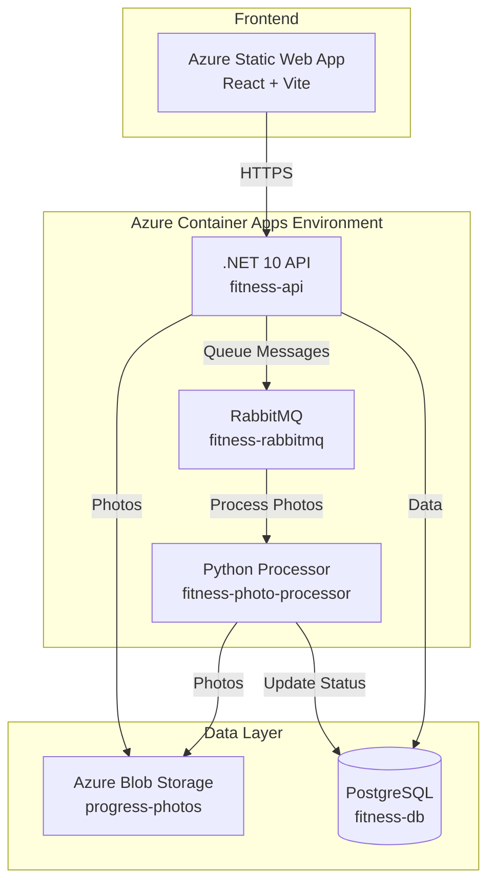

# FitnessTracker - Azure Deployment Guide

> A comprehensive fitness tracking application with progress photo analysis, built with .NET 10, React, Python, and Azure services.

## 🏗️ Architecture



## ✨ Features

- **User Authentication** - JWT + HTTP-only cookies with ASP.NET Core Identity
- **Workout Tracking** - Log exercises, sets, reps, and personal records
- **Progress Photos** - Upload photos with automatic AI-powered body analysis
- **Pose Detection** - MediaPipe-based bodybuilding pose classification
- **Photo Processing** - Automatic cropping, thumbnails, and landmark visualization
- **API Versioning** - URL-based versioning (`/api/v1/...`)
- **Rate Limiting** - Built-in protection against abuse

## 🚀 Quick Start (Local Development)

### Prerequisites
- .NET 10 SDK
- Node.js 18+
- Python 3.11+
- PostgreSQL 14+
- RabbitMQ
- Docker (optional)

### 1. Clone Repository
```bash
git clone https://github.com/YOUR_USERNAME/FitnessTracker.git
cd FitnessTracker
```

### 2. Setup Database
```bash
# Create database
createdb fitness_tracker

# Update connection string in src/FitnessTracker.API/appsettings.json
```

### 3. Run Backend
```bash
cd src/FitnessTracker.API
dotnet run
```

### 4. Run Photo Processor
```bash
cd services/photo-processor
pip install -r requirements.txt
python main.py
```

### 5. Run Frontend
```bash
cd src/FitnessTracker.Web
npm install
npm run dev
```

Visit `http://localhost:5173`

## ☁️ Azure Deployment

### Resource Requirements
- Resource Group (`FitnessTrackerRG`)
- Virtual Network with 2 subnets
- PostgreSQL Flexible Server (Burstable, Standard_B1ms)
- Container Apps Environment
- Container Registry
- Storage Account (Standard_LRS)
- Static Web App

### Estimated Monthly Cost
| Resource | Tier | Cost |
|----------|------|------|
| PostgreSQL | Burstable B1ms | ~$15 |
| Container Apps | Consumption | ~$0-5 |
| Storage Account | Standard_LRS | ~$0.01 |
| Static Web App | Free | $0 |
| Container Registry | Basic | ~$5 |
| **Total** | | **~$20-25/month** |

### Deployment Steps

#### 1. Create Infrastructure
```powershell
# Create resource group
az group create --name FitnessTrackerRG --location westus

# Create VNet
az network vnet create `
  --name fitness-vnet `
  --resource-group FitnessTrackerRG `
  --location westus `
  --address-prefixes 10.0.0.0/16

# Create subnets (apps + database)
az network vnet subnet create `
  --name snet-apps `
  --resource-group FitnessTrackerRG `
  --vnet-name fitness-vnet `
  --address-prefixes 10.0.0.0/23 `
  --delegations Microsoft.App/environments

az network vnet subnet create `
  --name snet-db `
  --resource-group FitnessTrackerRG `
  --vnet-name fitness-vnet `
  --address-prefixes 10.0.2.0/24 `
  --delegations Microsoft.DBforPostgreSQL/flexibleServers
```

#### 2. Create Database
```powershell
az postgres flexible-server create `
  --resource-group FitnessTrackerRG `
  --name fitness-db `
  --location westus `
  --admin-user myadmin `
  --admin-password "YourStrongPassword!" `
  --sku-name Standard_B1ms `
  --tier Burstable `
  --vnet fitness-vnet `
  --subnet snet-db
```

#### 3. Create Storage Account
```powershell
az storage account create `
  --name fitnesstrackerstg `
  --resource-group FitnessTrackerRG `
  --location westus `
  --sku Standard_LRS

az storage container create `
  --name progress-photos `
  --account-name fitnesstrackerstg `
  --public-access off
```

#### 4. Setup GitHub Secrets

Configure these secrets in your GitHub repository:

| Secret Name | Value |
|-------------|-------|
| `AZURE_CREDENTIALS` | Service principal JSON from `az ad sp create-for-rbac` |
| `ACR_LOGIN_SERVER` | `youracr.azurecr.io` |
| `ACR_USERNAME` | From `az acr credential show` |
| `ACR_PASSWORD` | From `az acr credential show` |
| `DB_CONNECTION_STRING` | PostgreSQL connection string |
| `AZURE_STORAGE_CONNECTION_STRING` | From `az storage account show-connection-string` |
| `VITE_API_URL` | Your API URL from Container Apps |

#### 5. Deploy Containers

The complete deployment commands are in [`docs/Azure-Deployment-Walkthrough.md`](docs/Azure-Deployment-Walkthrough.md).

Key environment variables:

**API Container:**
```powershell
--env-vars `
  "ConnectionStrings__DefaultConnection=..." `
  "RabbitMQ__Host=..." `
  "AzureStorage__ConnectionString=..." `
  "AllowedOrigins__0=https://your-app.azurestaticapps.net" `
  "CookieSettings__SameSiteMode=None"
```

**Photo Processor:**
```powershell
--env-vars `
  "RABBITMQ_HOST=..." `
  "DB_HOST=fitness-db.postgres.database.azure.com" `
  "DB_NAME=fitnessTracker" `
  "AZURE_STORAGE_CONNECTION_STRING=..."
```

## 📁 Project Structure

```
FitnessTracker/
├── src/
│   ├── FitnessTracker.API/          # .NET 10 Web API
│   ├── FitnessTracker.Core/         # Domain entities & interfaces
│   ├── FitnessTracker.Infrastructure/ # Data access & services
│   └── FitnessTracker.Web/          # React frontend (Vite)
├── services/
│   └── photo-processor/             # Python image processing service
├── .github/
│   └── workflows/                   # CI/CD pipelines
└── docs/                            # Documentation
```

## 🔧 Technology Stack

### Frontend
- React 18 with Vite
- Material-UI (MUI)
- React Router v6
- Axios for API calls

### Backend API
- .NET 10 (ASP.NET Core)
- Entity Framework Core
- PostgreSQL
- JWT Authentication
- ASP.NET Core Identity
- RabbitMQ (via pika client)

### Photo Processor
- Python 3.11
- MediaPipe (pose detection)
- OpenCV (image processing)
- Pillow (thumbnails)
- pika (RabbitMQ client)
- psycopg2 (PostgreSQL)

### Azure Services
- **Container Apps** - API & Python processor hosting
- **Static Web Apps** - Frontend hosting
- **PostgreSQL Flexible Server** - Database
- **Blob Storage** - Photo storage with SAS tokens
- **Container Registry** - Docker image storage
- **Virtual Network** - Secure networking

## 🐛 Troubleshooting

### Common Issues

**1. Frontend shows "Failed to Fetch"**
- Ensure `VITE_API_URL` is set correctly in `.env.production`
- Check CORS settings in API (`AllowedOrigins`)

**2. Photos stuck in "Pending" status**
- Check RabbitMQ connectivity (use full FQDN, not short hostname)
- Verify Azure Storage connection string is set on both API and Processor
- Check processor logs: `az containerapp logs show --name fitness-photo-processor`

**3. Login fails with 401**
- Verify `CookieSettings__SameSiteMode=None` is set
- Ensure `CookieSettings__SecureCookies=true` for HTTPS
- Check `AllowedOrigins` matches your frontend URL exactly

**4. Database connection errors**
- Use public FQDN: `fitness-db.postgres.database.azure.com`
- Database name is case-sensitive: `fitnessTracker`
- Don't use private DNS name - it often fails to resolve

See [`docs/Azure-Deployment-Walkthrough.md`](docs/Azure-Deployment-Walkthrough.md) for comprehensive troubleshooting with 10+ documented issues and solutions.

## 📖 Documentation

- **[Azure Deployment Walkthrough](docs/Azure-Deployment-Walkthrough.md)** - Complete step-by-step Azure setup
- **[Blob Storage Integration](docs/blob-storage-deployment.md)** - Shared storage setup guide
- **[API Documentation](src/FitnessTracker.API/README.md)** - API endpoints & authentication
- **[Photo Processor](services/photo-processor/README.md)** - Image processing pipeline

## 🔐 Security Features

- **Authentication**: JWT tokens in HTTP-only cookies
- **Password Requirements**: Minimum 10 characters with complexity rules
- **CORS**: Configured for specific frontend origin
- **Rate Limiting**: 100 requests/minute per client
- **Secure Cookies**: SameSite=None with Secure flag for cross-domain
- **Private Networking**: Database and RabbitMQ in VNet
- **Blob Storage**: Private containers with time-limited SAS URLs

## 🤝 Contributing

1. Fork the repository
2. Create a feature branch (`git checkout -b feature/amazing-feature`)
3. Commit your changes (`git commit -m 'Add amazing feature'`)
4. Push to the branch (`git push origin feature/amazing-feature`)
5. Open a Pull Request

## 📝 License

This project is licensed under the MIT License.

## 🙏 Acknowledgments

- [MediaPipe](https://google.github.io/mediapipe/) - Pose detection
- [Material-UI](https://mui.com/) - React components
- [RabbitMQ](https://www.rabbitmq.com/) - Message broker

---

**Need Help?** Check the [troubleshooting guide](docs/Azure-Deployment-Walkthrough.md#troubleshooting--production-configuration) or open an issue.
